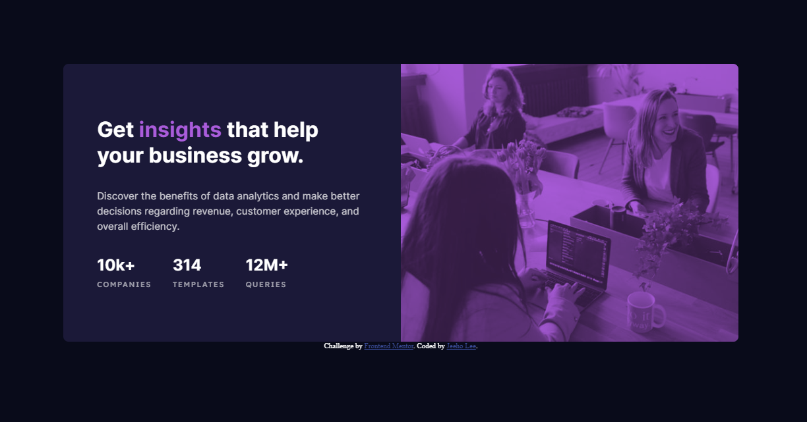

# Frontend Mentor - Stats preview card component solution

This is a solution to the [Stats preview card component challenge on Frontend Mentor](https://www.frontendmentor.io/challenges/stats-preview-card-component-8JqbgoU62). Frontend Mentor challenges help you improve your coding skills by building realistic projects. 

## Table of contents

- [Overview](#overview)
  - [The challenge](#the-challenge)
  - [Screenshot](#screenshot)
  - [Links](#links)
- [My process](#my-process)
  - [Built with](#built-with)
  - [What I learned](#what-i-learned)
  - [Continued development](#continued-development)
  - [Useful resources](#useful-resources)
- [Author](#author)
- [Acknowledgments](#acknowledgments)

## Overview

### The challenge

Users should be able to:

- View the optimal layout depending on their device's screen size

### Screenshot

### Links

- Solution URL: [https://github.com/jeeheezy/FEM-Stats-Preview-Card-Component](https://github.com/jeeheezy/FEM-Stats-Preview-Card-Component)
- Live Site URL: [https://jeeheezy.github.io/FEM-Stats-Preview-Card-Component/](https://jeeheezy.github.io/FEM-Stats-Preview-Card-Component/)

## My process

### Built with

- Semantic HTML5 markup
- Flexbox
- Mobile-first workflow

### What I learned

This was the first time I used the picture html tag instead of img, which helps change the source of the image for responsive layouts. A particular note to make about applying CSS to the images using picture tag is that it ususally is added to the img tag inside the picture tag, since picture's primary purpose is to change the source being referenced. This was also my first time making use of the mix-blend-mode property to apply color on an image.

This was also a good exercise on scaling image size in respect to it's container while retaining the space ratio. There were a few methods of doing this that I could find, like setting max-width/width or flex-basis. The key property to get maintain a 50/50 container split was using the box-sizing: border-box to ensure padding and borders are included in the width calculations. 

### Continued development

I'd like to get more practice with responsive layouts that aren't changed just by media queries but can actively scale with the screen size.

### Useful resources

- [Stack overflow thread](https://stackoverflow.com/questions/33145242/why-is-padding-expanding-a-flex-item) - This thread helped me understand how the flex property works and why I was still having issues with flex items being different sizes than what I had wanted.

## Author

- Website - [Jeeho Lee](https://www.linkedin.com/in/jeeho-lee-719852182/)
- Frontend Mentor - [@jeeheezy](https://www.frontendmentor.io/profile/jeeheezy)

## Acknowledgments

Big thanks to Grace-Snow on the Frontend Mentor discord channel for giving suggestions for improvement and clarification on how the flex property works!